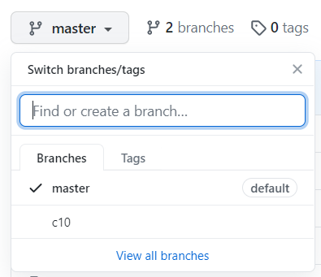

## Ветвление в Git

[<-- Назад](./9_Work_with_Git_and_GithHub.md)
[Содержание](./readme.md)
[Вперед -->](./)

---

До этого мы работали сразу с конечным продуктом, делая изменения непосредственно в нем. Но что если нам необходимо разработать какую-то часть, не трогая готовый продукт? Или над продуктом работают сразу несколько разработчиков, каждый из которых делает что-то свое? 

Для таких целей в Git существует понятие ветвления. Чтобы создать новую ветку на основе существующего репозитория, необходимо использовать команду `git branch имя_ветки`.

Команда выполнилась, но мы все еще находимся в главной (master) ветке. Чтобы переключиться на новую, используем команду `git checkout имя_ветки`. Теперь мы можем работать именно с ней. 

Есть способ создать ветку и сразу же переключиться в нее:

```
git checkout -b имя_ветки
```

Если мы сделаем коммит и пуш отдельной ветки на GitHub, там так же будет создана отдельная ветка и все наши изменения попадут именно в нее, а не в мастер-ветку. На GitHub переключаться между ветками можно с помощью специальной вкладки.



На изображении выше видно, что кроме "master", появилась еще и вторая ветка "c10".

Чтобы добавить наши изменения в ветку master, необходимо перейти в нее и использовать команду `git merge имя_ветки`. 

Если ветка больше не нужна, ее можно удалить следующей командой:

```
git branch -D имя_ветки
```


---
[<-- Назад](./9_Work_with_Git_and_GithHub.md)
[Содержание](./readme.md)
[Вперед -->](./)