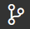
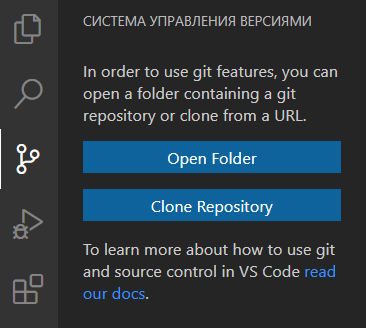
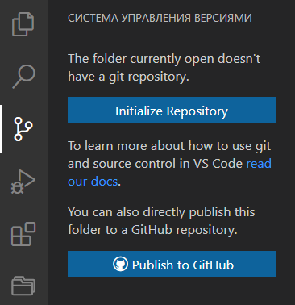
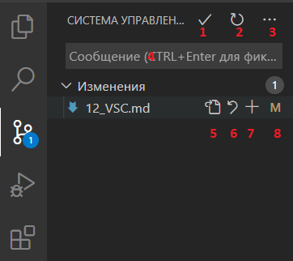
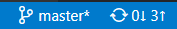

## Интерфейс VS Code для работы с Git

[<-- Назад](./11_Other_Commands.md)
[Содержание](./readme.md)
[Вперед -->](./13_ExtensionForGit.md)

---

До этого мы работали с Git лишь посредством команд в терминале. Однако редактор Visual Studio Code предоставляет свой интерфейс для этого. Он находится на вкладке  на боковой панели слева. 

В случае, если никакая папка проекта не редакторе не выбрана, VS Code предоставит следующий выбор:

* **Open Folder** — просто откроет папку на компьютере пользователя для дальнейших действий;
* **Clone Repository** — выполнит команду `git clone`. В строку, которая появится сверху достаточно вставить URL адрес удаленного репозитория.

Если же папка проекта была открыта, будут предложены следующие варианты:

* **Initialize Repository** — выполнит команду `git init` и создаст локальный репозиторий в текущем каталоге;
* **Publish to GitHub** — создает локальный репозиторий и одновременно публикует его в вашем профиле на GitHub. 

Рассмотрим интерфейс VS Code после создания репозитория. В верхней части находятся следующие элементы:

1. Выполняет команду `git commit`. Если сообщение для коммита не было введено заранее, предоставляет отдельное поле ввода для этого;
2. Иногда Git долго не замечает например, удаление какого-то изображения. Это действие принудительно обновляет информацию о файлах проекта;
3. Дополнительные команды для Git. В том числе уже знакомые нам `git pull` и `git push`;
4. После ввода сообщения для коммита;
5. Открывает в редакторе выбранный файл;
6. Выполняет команду `git reset` для выбранного файла, либо для всех файлов в списке;
7. Выполняет команду `git add` для выбранного файла, либо для всех файлов в списке. Если файл уже в индексе, вид значка изменится на [**—**] и будет выполняться команда `git rm --cached`;
8. [Статус](./6_Status_and_commits.md) файла.

Чтобы применять действия ко всем файлам в списке, нужно навести курсор на заголовок этого списка.

В нижней части VS Code находится статус-бар. В нем так же присутствуют элементы Git:

В данном случае "master" — это название нашей текущей ветки. Нажав на него, можно перейти в другую, аналогично команде `git checkout`. Или создать новую, аналогично команде `git branch`.

Рядом с веткой расположена кнопка синхронизации с удаленнным репозиторием. Первое число показывает, сколько изменений будет получено командой `git pull`, второе — сколько будет отправленно командой `git push`. 

Если соединение с удаленным репозиторием отсутствует, вместо синхронизации будет кнопка публикации репозитория .

---
[<-- Назад](./11_Other_Commands.md)
[Содержание](./readme.md)
[Вперед -->](./13_ExtensionForGit.md)