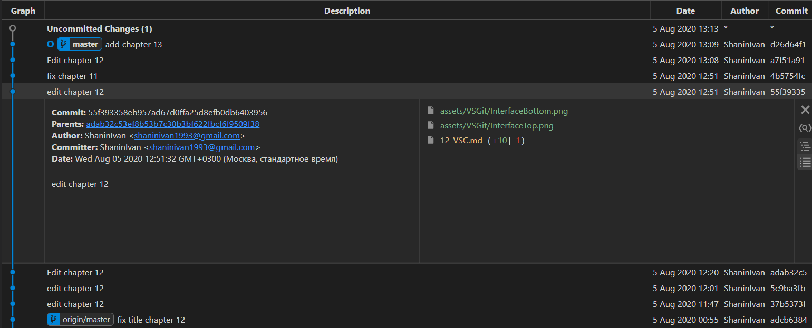

## Расширения VS Code для Git

[<-- Назад](./12_VSC.md)
[Содержание](./readme.md)
[Вперед -->](./14_Conclusion.md)

---

Ранее я уже упоминал расширение VS Code для создания файлов .gitignore. Однако существует еще несколько полезных инструментов.

### Git Graph

Предоставляет удобную историю коммитов с разделением по ветвям. Открыть интерфейс можно соответсвующим значком в панели Git, либо нажав "Git Graph" на статус-баре.

### GitLens 

Еще более мощный инструмент для просмотра истории Git. Подсвечивает последний коммит для места, на котором стоит курсор и предоставляет новую вкладку на боковой панели с собственными инструментами.

---
[<-- Назад](./12_VSC.md)
[Содержание](./readme.md)
[Вперед -->](./14_Conclusion.md)