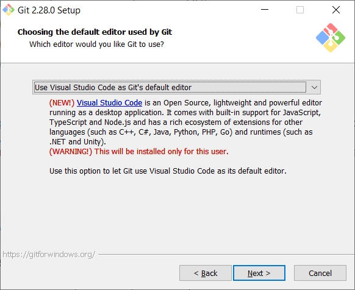

## Установка Git на Windows 10

[<-- Назад](./1_Git_and_Github.md)
[Содержание](./readme.md)
[Вперед -->](./3_Settings_Git.md)

---

Для работы с Git, его необходимо сначала установить на компьютер. Мы будем ставить его на систему Windows 10 x64.

Переходим на [официальный сайт Git](https://git-scm.com/downloads) и и выбираем "Windows". Загрузка должна начаться сама, но если этого
не произошло, нажмите "Click here to download manually".

### **Процесс установки Git:**

1. Открываем загруженный файл и соглашаемся с лицензией, нажав "Next".

2. Выбираем путь, по которому Git будет установлен в вашей системе. Не следует путать это с путем репозитория — они создаются отдельно.

3. Выберираем необходимые компоненты Git:
    * *Additional icons* — добавляет иконки Git на рабочий стол;
    * *Windows Explorer integration* — добавляет действия в контекстное меню Windows (правая кнопка мыши). Git Brash и Git GUI 
    соответственно;
    * *Git LFS (Large File Support)* — расширение Git для работы с большими файлами;
    * _Associate .git* configuration files with the default text editor_ — ассоциирует файлы типа .git* с текстовым редактором Windows,
    стоящим по умолчанию;
    * *Use a TrueType font in all console windows*  — во всех консольных окнах будет использоваться шрифт TrueType;
    * *Check daily for Git for Windows updates* — ежедневно проверять обновления Git.

4. Выбираем название папки в меню "Пуск" Windows, либо отказываемся от ее создания.

5. Выбираем редактор кода, который Git будет использовать по умолчанию.

6. Выбираем способ использования из командной строки:
    * *Use Git from Git Bash only* — использование только из командной строки Bash;
    * *Use Git from the Windows Command Prompt* — использование командной строки Bash, а также минимальный набор 
    команд Git из консоли Windows;
    * *Use Git and optional Unix tools from the Windows Command Prompt* — использование Git и утилит Unix из командной строки Windows,
     в этом случае будут перезаписаны некоторые утилиты Windows, например find и sort.

7. Выберете библиотку, которая будет использована при подключении по протоколу HTTPS:
    * *OpenSSL* — сертификаты сервера будут проверяться с использованием Unix-файла ca-bundle.crt;
    * *Windows Secure Channel* — сертификаты сервера будут проверяться с использованием стандартной библиотеки Windows.

8. Убедитесь, что вы выбрали способ обработки окончания строк "*Checkout Windows-style, commit Unix-style line endings*". 
Это значение гарантирует, что Git преобразует LF в CRLF при проверке текстовых файлов. При выполнении текстовых файлов 
CRLF также преобразуется в LF. Это мера совместимости для защиты новых строк в текстовых файлах, что позволяет легко работать 
с текстовыми файлами в Windows и на платформах Unix.

9. Выберите, какой териминал будет использоваться с Git Bash:
    * *MinTTY* - терминал Unix;
    * *Windows* - стандартный терминал Windows.

10. Поведение Git Pull оставляем по умолчанию.

11. Как и менеджер учетных данных.

12. Выбираем дополнительные опции:
    * *File system caching* — кэширование файловой системы;
    * *Symbolic links* — разрешить символьные ссылки.

13. Жмем "Install".

---
[<-- Назад](./1_Git_and_Github.md)
[Содержание](./readme.md)
[Вперед -->](./3_Settings_Git.md)
