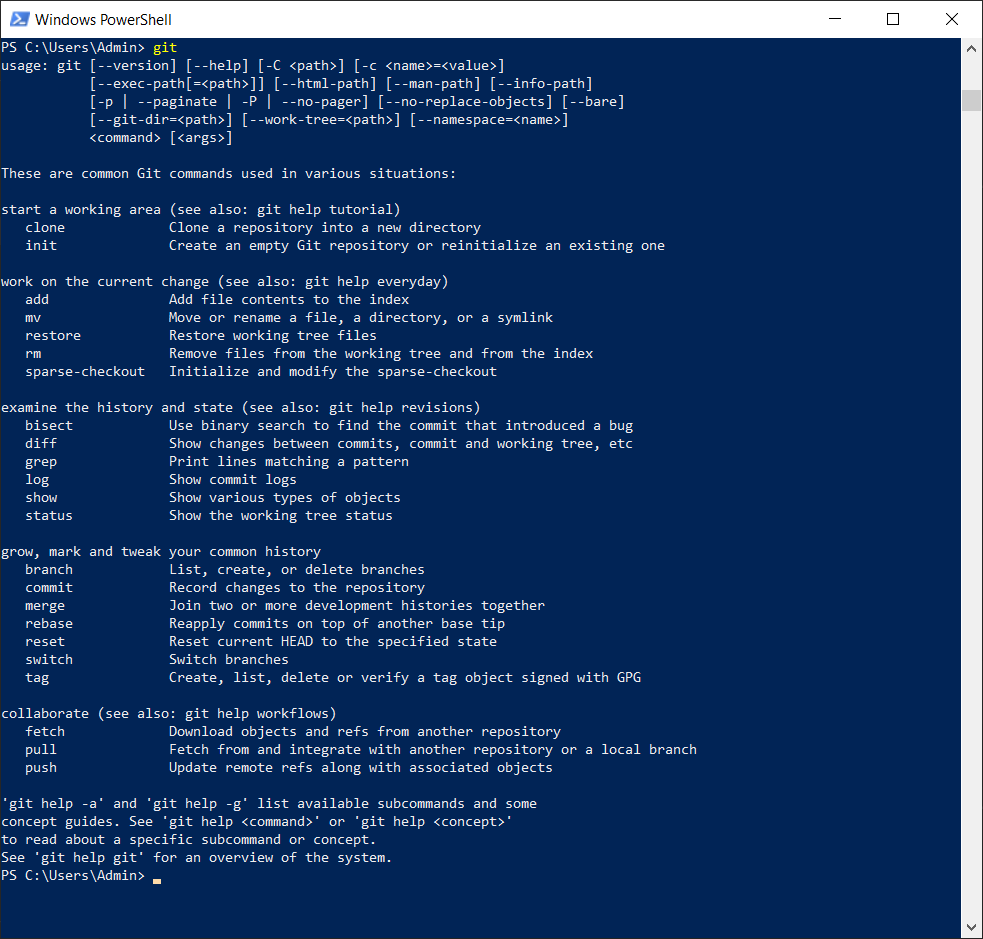

## Первоначальная настройка Git

[<-- Назад](./2_Install_Git.md)
[Содержание](./readme.md)
[Вперед -->](./4_GitRepository.md)

---

Перед работой с Git, необходимо прописать некоторые настройки.
Для этого откройте любой из терминалов:
* Командную строку Windows, нажав Win+R и введя "cmd";
* Windows PowerShell, найдя это приложение через поиск;
* Собственный терминал Git, вызвав контекстное меню Windows и выбрав "Git Bash Here"
* Встроенный терминал VS Code нажав ctrl+shift+`, внутри редактора.

Остановимся пока на PowerShell. 

Введя ключевое слово `Git` можно вывести список большинства команд Git'a. 



С него же начинаются любые другие команды, например `Git --version` или `Git init`.

В данный момент нас интересует команда `Git сonfig`.

Она отвечает за настройки Git. Конфигурация может быть трех уровней:
* --local — настройки проводятся и действительны только для конкретного проекта (если не указать на каком уровне назначается настройка, то по умолчанию конфигурация пройдет на локальном уровне), перебивает настройки заданные на системном и глобальном уровне;
* --global — настройки применятся под конкретного пользователя (если сначала задать конфигурацию на системном уровне, а потом задать такую же конфигурацию только с другим значением на глобальном уровне, то она перебьет и поменяет предыдущую  настройку, так как имеет высший уровень);
* --system — настройки применяться ко всей системе (ко всем пользователям и ко всем репозиториям).

Пропишем некоторые настройки на глобальном уровне:
```
git config --global user.name "Ваше_имя"
```
и
```
git config --global user.email Ваша_почта
```
Вместо Ваше_имя и Ваша_почта указываете свои данные. Их же потом будете использовать при регистрации на GitHub. Обратите внимание, что имя пишется в кавычках, а почта — нет. 

Чтобы убедиться, что команды сработали правильно, введите их без значений. Git вернет вам ранее записанные значения. 

---
[<-- Назад](./2_Install_Git.md)
[Содержание](./readme.md)
[Вперед -->](./4_GitRepository.md)
