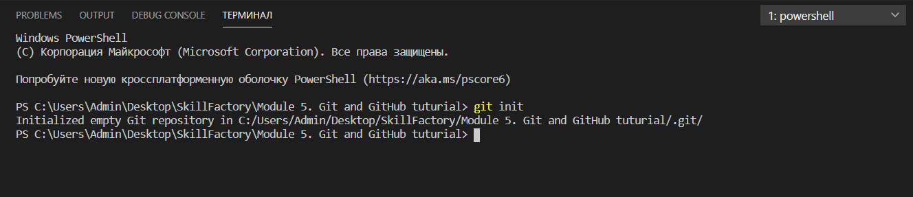
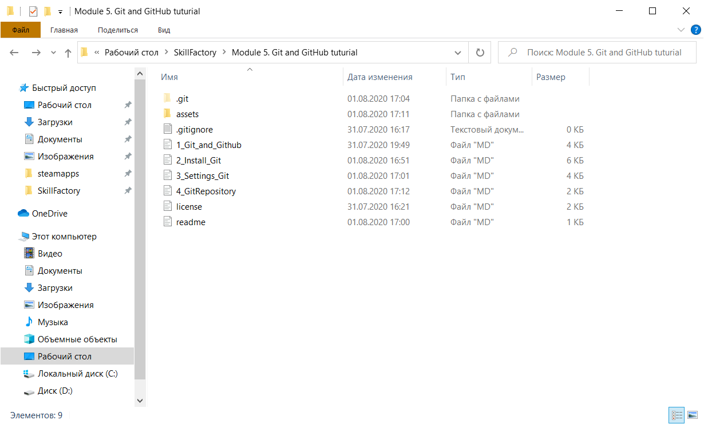

## Создание репозитория

[<-- Назад](./3_Settings_Git.md)
[Содержание](./readme.md)
[Вперед -->](./5_GitTerms.md)

---
Создадим репозиторий Git на примере этого туториала. Использовать будем терминал VS Code. 

Откроем папку проекта и вызовем терминал комбинацией клавиш ctrl+shift+`. 

Введем в терминале команду `git init`.
Терминал сообщит, что репозиторий создан (или переустановлен, если уже был) по адресу, соответствующему папке проекта. 

Если в проводнике включить показ скрытых элементов, можно увидеть скрытую папку с названием ".git". Это и есть созданный репозиторий.

После создания репозитория, список файлов проекта должен продублироваться в системе управления версиями. 

---

[<-- Назад](./3_Settings_Git.md)
[Содержание](./readme.md)
[Вперед -->](./5_GitTerms.md)