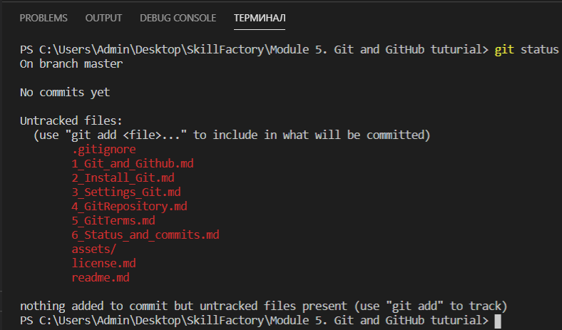
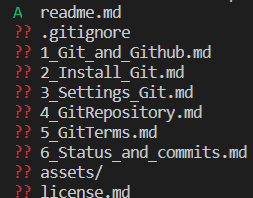
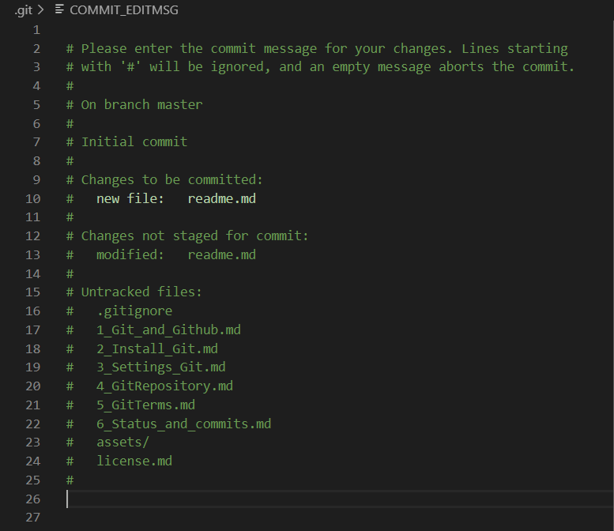

## Отслеживание файлов и коммиты

[<-- Назад](./5_GitTerms.md)
[Содержание](./readme.md)
[Вперед -->](./7_GitIgnore.md)

---

Файлы, добавленные в Git могут находится под котролем СКВ и нет. Для просмотра отслеживаемых файлов через терминал существует команда `git status`.
Введем ее на примере работы с этим туториалом. Получится вот такая картина:



Список файлов и каталогов в "Untracked files" в данный момент не отслеживается Git. Тут же в консоли видна команда, которая может это исправить — `git add`.

Попробуем добавить файл Readme. И снова проверим статус. Терерь наш файл находится в списке "Changes to be commited" и Git следит за ним. Если вместо файла указать каталог, под взор Git попадет все его содержимое. А чтобы добавить всю рабочую область, можно использовать команду `git add :/`.

Попробуем теперь немного изменить этот файл. Git заметит это и при проверке статуса отобразит его в "Changes not staged for commit".
Это значит, что файл был изменен, но пока не проиндексирован. Чтобы это сделать, необходимо снова применить к нему команду добавления.

Для статуса существует команда сокращенного вывода: `git status -s`.

При ее использовании получится вот такой список:



В левом столбце находится статус файла, в правом — его название. Статусы бывают:
* **??** — Git не следит за файлом;
* **!** — файл .gitignore запрещает следить за этим файлом;
* **A** — файл под наблюдением и проиндексирован;
* **M** — в файл внесены изменения и их необходимо индексировать; 
* **D** — файл удален;
* **R** — файл переименован.

Статусы могут сочетаться, наример "АМ" будет означать, что часть изменений уже была проиндексирована, но были внесены новые. 


Чтобы через терминал увидеть изменения более подробно можно использовать команду `git diff`.

В данном случае, был добавлет новый пункт (7) в содержание.


Следует отметить, что эта команда показывает только непроиндексированные изменения. А чтобы увидеть индексированные, можно использовать любую из этих команд:
```
git diff --cached
```
```
git diff --staged
```

Теперь можно зафиксировать изменения, иначе говоря сделать коммит. Помните, что в коммит попадут только <u>индексированные</u> изменения, поэтому не забудьте использвать `git add` на нужных файлах. 

Для того, чтобы сделать коммит, нужно использовать созвучную команду: `git commit`. После этого откроется текстовый редактор. В VS Code он выглядит вот так:



Введите сообщение к вашему коммиту. Комментарии, которые начинаются на "#" можно стереть или оставить — на ваш выбор. Чтобы сохранить коммит — просто закройте окно редактора. Сообщение в коммите следует делать информативным, но в тоже время кратким. Подробно об оформлении коммитов можно почитать вот в [этой статье на Хабре](https://habr.com/ru/post/416887/).


---
[<-- Назад](./5_GitTerms.md)
[Содержание](./readme.md)
[Вперед -->](./7_GitIgnore.md)