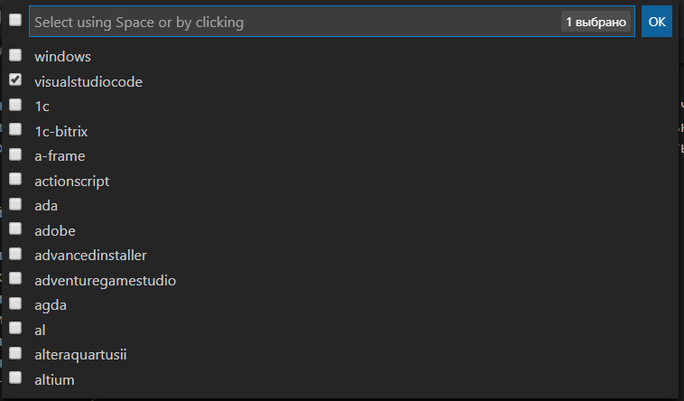

## Файл .gitignore

[<-- Назад](./6_Status_and_commits.md)
[Содержание](./readme.md)
[Вперед -->](./8_GitHub.md)

---

Согласитесь, неудобно при работе с Git каждый раз обрабатывать все файлы по отдельности. Но что если мы не хотим, чтобы при общей сборке репозитория, в нее попал какой-нибудь мусор? Чтобы этого избежать, в Git существует специальный файл, называемый ".gitignore". Названия файлов, каталоги и специальные шаблоны, которые прописаны в нем, будут полностью игнорироваться Git. Обычно туда прописывают разные "технические" файлы вроде автоматических логов вашего редактора кода. 

Для правильной работы файла при его создании его нужно назвать ".gitignore" (без расширения) и никак иначе. 

При оформлении файла используются следующие правила:
* Пустые строки игнорируются;
* Строки, начинающиеся с `#` считаются комментарием и так же игнорируются;
* Шаблоны применяются для всех вложенных каталогов, но не вверх;
* Чтобы избежать рекурсии используйте символ `/` в начале шаблона;
* Чтобы исключить каталог добавьте `/` в конец шаблона;
* Чтобы сделать исключение, используйте знак `!` в начале строки;
* Символ `*` заменяет любое количество символов;
* Символ `?` заменяет один символ;
* Конструкции формата `[0-9]` позволяют выбрать диапазон символов.

На GitHub существует [список готовых .gitignore](https://github.com/github/gitignore) под разные случаи. 

Так же в VS Code существует расширение, которое называется ".gitignore Generator". Оно позволяет выбрать, для чего создавать исключения. 
Чтобы использовать его, сделайте следующее:
1. Перейдите в "расширения" (ctrl+shift+X);
2. Введите в поиске ".gitignore Generator". Выбирайте последнюю версию; 
3. Установите расширение;
4. Откройте в редакторе папку вашего проекта;
5. Вызовите команды (ctrl+shift+P) и найдите "Geterate .gitignore File";
6. Выберите нужные пункты. В нашем случае хватит только VS Code;


В итоге у нас появится файл .gitignore с готовым содержимым:
```
# File created using '.gitignore Generator' for Visual Studio Code: https://bit.ly/vscode-gig

# Created by https://www.toptal.com/developers/gitignore/api/visualstudiocode
# Edit at https://www.toptal.com/developers/gitignore?templates=visualstudiocode

### VisualStudioCode ###
.vscode/*
!.vscode/settings.json
!.vscode/tasks.json
!.vscode/launch.json
!.vscode/extensions.json
*.code-workspace

### VisualStudioCode Patch ###
# Ignore all local history of files
.history

# End of https://www.toptal.com/developers/gitignore/api/visualstudiocode

# Custom rules (everything added below won't be overriden by 'Generate .gitignore File' if you use 'Update' option)
```

---
[<-- Назад](./6_Status_and_commits.md)
[Содержание](./readme.md)
[Вперед -->](./8_GitHub.md)