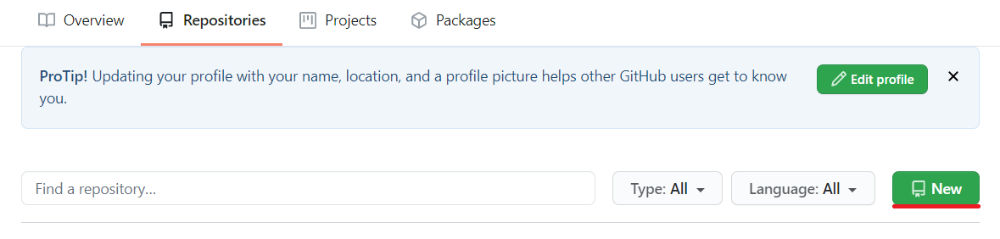

## Создание аккаунта на GitHub и создание репозитория

[<-- Назад](./7_GitIgnore.md)
[Содержание](./readme.md)
[Вперед -->](./9_Work_with_Git_and_GithHub.md)

---

Пришло время познакомиться с глобальным хостингом репозиториев — GitHub.

Для начала перейдем на [сайт](https://github.com/) хостинга. Нам необходимо создать аккаунт. Для это введите свои имя прользователя, почту и пароль в предложенном окне. Желательно вводить те же данные, которыми [настраивали](./3_Settings_Git.md) систему Git на вашем компьютере. 

После ввода данных нажмите "Sing up for GitHub". Надо будет решить небольшую задачку, стрелочками ставя нарисованных животных "на ноги". Это своеобразная защита от ботов. После чего нажать "Join a free plan".

Следующим шагом GitHub предложит рассказать о себе, выбрав определенные пункты. Делать это не обязательно, можно сразу нажать "Complite settings". 

И наконец, останется подтвердить указанный вами email. 

Аккаунт мы создали. Теперь создадим первый репозиторий. Для этого в панели сверху выберите вкладку "Repositories" и внутри нее нажмите кнопку "New". 

Далее следует оформить следующие поля:
* **Repository name** — название репозитория. Это поле является обязательным;
* **Description** — описания репозитория;
* **Public и Private** — доступ к репозиторию: публичный или приватный. Однако редактировать репозиторий в любом случае могут только отдельно указанные лица. 

Следующие шаги пропускаем, если будет импонтирован готовый репозиторий: 
* **Initialize this repository with a README** — добавляет в репозиторий файл Readme. Для посетителей репозитория он будет работать как главная страница сайта;
* **add .gitignore** — добавляет готовый [файл .gitignore](./7_GitIgnore.md) для выбранной области;
* **add a license** — добавляет лицензию, по которой можно использовать ваш репозиторий. Полный список лицензий с их описанием и применением можно найти [тут](http://licenseit.ru/wiki/index.php).

После заполнения полей, нажмите "Create Repository". 

---
[<-- Назад](./7_GitIgnore.md)
[Содержание](./readme.md)
[Вперед -->](./9_Work_with_Git_and_GithHub.md)